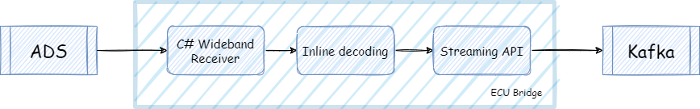
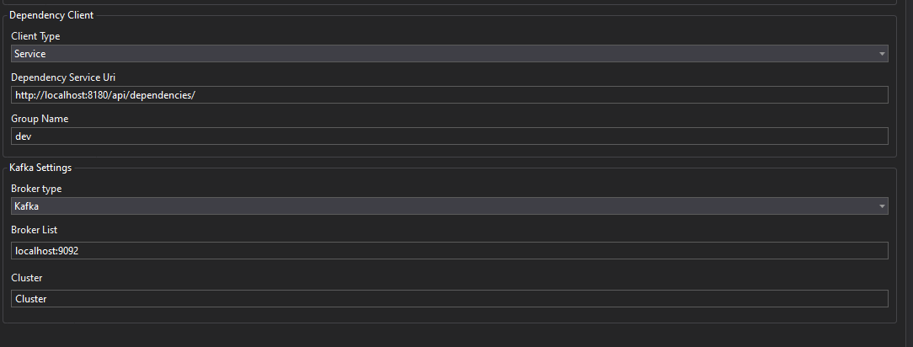
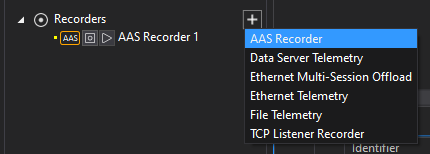
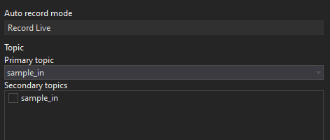

# ECU Bridge

## Concept

The ECU Bridge is a standalone application bridging data between incoming ATLAS telemetry and Kafka.



## Prerequisites

- .NET 4.6.2
- Appropriate [license](#licensing)

## Configuration

Unzip the ECU Bridge 0.13.0.zip file

Configuration is located in _Config.json_, which specifies:

- Wideband recorder(s)
- System Monitor directories
- Kafka connection string

Here is a reference example, for a localhost ADS, Kafka broker and a dependencies service:

```json 
{
  "TestMode": false, 
  "RecorderType": "kafka",
  "ReceiverType": "Wideband",
  "ReceiverSettings": {
    "WidebandReceiver": {
      "Host": "localhost",
      "StreamName": "Default"
    }
  },
  "MetricsSettings": {
    "Enabled": true,
    "Port":  9505 
  },
  "RdaUnlockSettings": {
    "UnlockFileDirectories": "X:\\config\\PUL"
  },
  "RecorderSettings": {
    "PgvSettings": {
      "Path": "X:\\config"
    },
    "ConfigSettings": {
      "Path": "X:\\config\\Cfgs"
    },
    "KafkaSettings": {
      "DependencyUri": "http://localhost:8180/api/dependencies/",
      "BrokerList": "localhost:9092",
      "SessionIdentifier": "Example identifier %r %y%m%d%H%M%S",
      "TopicName": "AllSamples",
      "SessionDetails": {
        "Driver": "$NDriverInitial1$$NDriverInitial2$$NDriverInitial3$"
      }
    }
  }
}
```

This is completely independent of ATLAS registry settings, but does still require specific "ECU Bridge" license.

For a detailed configuration reference, consult the _readme_ file included in the zip distribution.

Make sure that your ADS is setup properly:

In ADS Options > *Recording* > *Advanced Data Feed*

* Enable Advanced Data Feed Producer = TRUE
* client.id	= (unique number; NOT 0)
* metadata.broker.list = <ip1>:9092,<ip2>:9092,<ip3>:9092

The client ID must be unique to avoid conflicts with other ADS instances. Unless advised otherwise, use the last quad of
your FIA-assigned ADS IP address. For example, if your IP address is 172.16.53.111, then your id would be: 111

## Running the service

Review the _Config.json_, and edit the paths and service urls to match your environment.

> Note: System Monitor settings applied in ATLAS/ADS are ignored

Create the ropic using the Topic Management Service (runs by default on http://localhost:8182). In the sample file above, the output topic is names _AllSamples_.

To run the application from a command prompt:

```
MAT.TAP.Recorders.Standalone.exe
```

## Replaying Raw Files

Modify the configuration file to specify file replay, as follows:

```json
...
"ReceiverSettings": {
    "FileReceiver": {
      "File": "X:\\data\\races\\Race.ssn_16.raw_tm",
      "PlaybackSpeed": 1,
      "Loop": false
    }
},
...
```

<!-- TODO: Find out if the following section is still valid
refer to: https://mclarenappliedtechnologies.zendesk.com/knowledge/articles/360010656973/en-us?brand_id=1083465
## Limitations

This preview service forwards only samples and laps.

It does support backfill, but does not yet provide resampling, latency or coverage control.
Events are not yet supported.

You cannot select subsets of parameters - this service streams everything. This is ideal for use cases centered on export and data movement, but less useful for model execution. -->

## ATLAS Visualization

You can setup an ATLAS Advanced Stream (AAS) recorder in ATLAS to view the live data from Kafka.

In Tools > Options > Recorders > AAS Recorder, setup the AAS Recorder as follows (example below is for Kafka broker and [dependency service](./dependencies-service.md) both running locally):



In ATLAS, add an AAS recorder from Session Browser:



The relevant topic should appear in the Recorder Editor's drop down ("sample_in" in this case):

 

## Licensing

ECU Bridge service requires a standalone "ECU Bridge" license, with a dependency on requiring an ATLAS Data Platform Site license. 