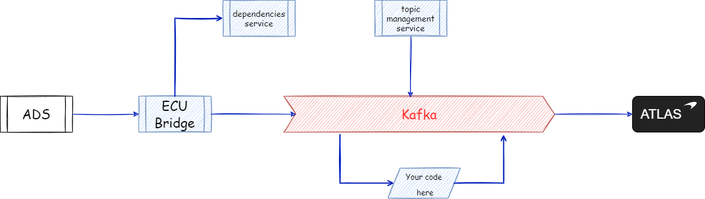

# Architecture Overview

ATLAS Advanced Streams is designed to work as part of your infrastructure, rather than as interconnected desktop applications.

Here is the overall picture:

Your code interacts with Kafka through a client library provided as [Nuget package](../../../nuget/index.md).

You will need to install supporting components either locally on your laptop, or somewhere central in your development network.