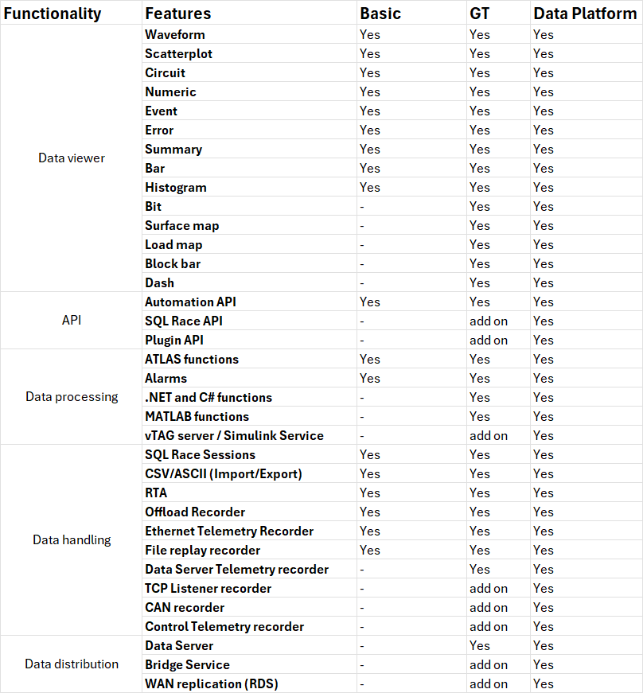

# ATLAS variants

## ATLAS packages 

Various ATLAS functionality will be enable by different licensable variants. There are three main licence variants: ATLAS Basic, ATLAS GT and ATLAS Data Platform. ATLAS GT is also provided FoC for academic use for Universities and academic institutions

### ATLAS Basic

ATLAS Basic represents the entry product, offering all basic features needed for data analysis while limiting its degree of customisation

### ATLAS GT

ATLAS GT offers all common features within the software, while advanced add-ons such as model execution, .NET/MATLAB Functions or APIs made available for purchase

### ATLAS Data Platform

ATLAS Data Platform is the full, top-end variant of the product family including all add-ons and targeting customers willing to get the most out of their ATLAS experience

## Comparison Matrix

## Add-ons

### Application Programming Interfaces 
* **SQL Race API** is for reading, writing and managing session data – replacing the old SSN files. ATLAS uses SQL Race API for all session data access. The new storage approach uses a database to manage the session data and configuration, together with a conventional Windows file share. For more details please refer to [SQL Race API](https://atlas.mclarenapplied.com/developer/sqlrace/)

* **Automation API** provides an API for interacting with currently running instance of ATLAS. This is based on the Windows Communication Foundation (WCF) framework. It will also provide compatibility for the legacy COM API. For more details please refer to [Automation API](https://mat-docs.github.io/Atlas.DisplayAPI.Documentation/articles/automation.html)

* **Plugin API** gives developers access to the heart of the ATLAS platform. Plugins can be created to extend all aspects of the application from visualizations to live data recording. For more details please refer to [Plugin API](https://atlas.mclarenapplied.com/developer/atlas-displayapi/)

### Data processing
* **vTAG execution service** enables you to run MATLAB (Simulink) simulations. The Simulink model can be executed with the vTAG Server set up from System Monitor and data analysis from ATLAS. The complete data stream is visualised in ATLAS as if all data came from the car.

* **.NET and MATLAB functions:** In addition to functions written in ATLAS's Function Definition Language (FDL) ATLAS is able to call external interpreters to evaluate functions in the .NET runtime as well as functions written in MATLAB.

### Data Ingest
* **MATLAB session access** allows MATLAB 1d and 2d file formats to be read/written within ATLAS

* *Live data ingest or Recorder interface*
    * **Ethernet Recorder:** Some types of controllers communicate with ATLAS via Ethernet. Ethernet Recorder allows for the continuous data upload from one of these systems
    * **TCP Listener Recorder:** Some types of controllers communicate with ATLAS via TCP protocol. TCP Listener Recorder allows for the continuous data upload from one of these systems
    * **File Telemetry Recorder:** Telemetry file recorder is a diagnostics tool which replays Raw Data

### Data Distribution
* **Data Server:** ATLAS Data Server utility controls the process of receiving data via Wide Band telemetry, or Ethernet Wirelink and sending it to one or more Client PCs over an Ethernet network.

