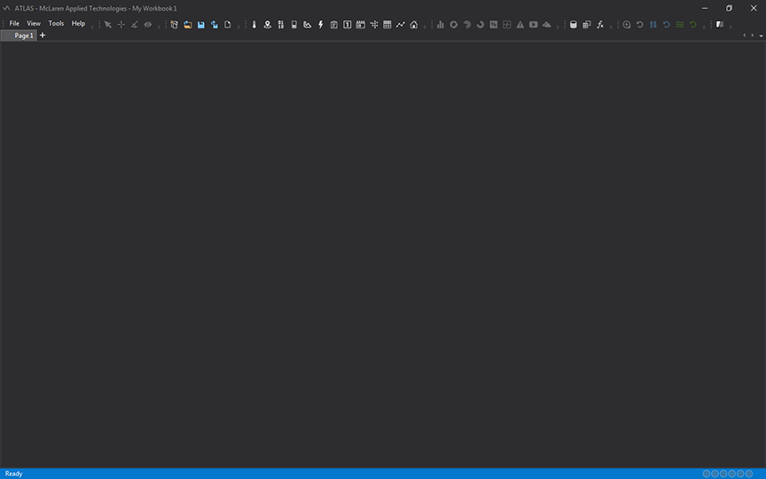
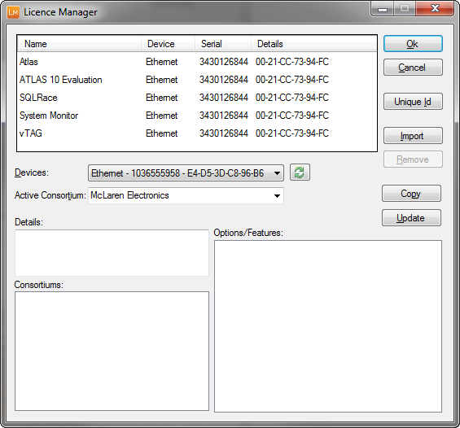

# Getting started

## Launching ATLAS

To start ATLAS, if installed in the default location:

* Click Start > All Programs > McLaren Applied Technologies> ATLAS

A new Workbook is opened with a single empty Page by default

* To start using ATLAS:
    * Record a Session or load one or more Compare Sets.
    * Add at least one Display to your Workbook.
    * Select one or more Parameters to be shown on the Display.

## Adding a Licence

Use the Licence Manager utility to display and modify licence information. Licence codes may be added after ATLAS has been installed.
The default location on the Start menu is: All Programs > McLaren Applied Technologies >  Licence Manager.

