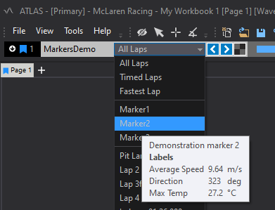

# Markers

## Overview

Markers are used to define a specific time or a time range within a session. They are completely customisable and can contain zero or more annotations to
describe what the marker represents. The following properties are available for each marker:

- Marker Type \- A string defining which group of markers this instance belongs to.
- Label \- A short, human readable summary of what the marker represents.
- Description \- A longer form human readable explanation of what the marker represents.
- Start Timestamp \- An optional point in the session where this range of interest begins. If not specified the start of the session is implied.
- End Timestamp \- An optional point in the session where this range of interest ends. If not specified the end of the session is implied.

!!! tip
    To create a marker which represents a specific point in time the start and end time properties can be set to the same value.

Each marker can have any number of labels associated with it to provide additional custom information. Marker labels have the following properties:

- Name \- A short, computer readable name for referencing the label in code.
- Label \- A short, human readable summary of what the label represents.
- Description \- A detailed, human readable explanation of what the label represents.
- Value \- A value associated with this marker.
- Format \- The C-Style format string used when displaying the value to the user e.g. `%.3f` for a real number displayed to 3 decimal places.
- Unit \- The definition of the units that the value is measured in.

None of these properties are mandatory and they can be used in any combination e.g. using only the label or using just the value and units.

The user can review and select markers using the timeline. If labels are present they will be displayed in the tooltip when hovering over the marker in
the drop down list. The following image shows an example of a marker with labels that was created using the SQL Race API as described below.



## Code Example

Markers can be added programmatically such as by a simulation model or separate analysis tool. An example of how to add a marker with some associated labels is shown below. A working sample of this code is provided in the introductory SQL Race API documentation available [here](https://github.com/mat-docs/MAT.OCS.SQLRace.Examples/blob/master/MAT.SQLRace.HelloData/Program.cs)

!!! example
    ```c#
    var marker = new Marker(markerStartTime, markerEndTime, "High Wind", "windSpeedData",
        "A period during which the wind was sustained above 9 m/s");

    marker.AddLabel(
        new MarkerLabel
        {
            Label = "Average Speed",
            Description = "An average sustained wind speed during this time period",
            Value = "9.6382834",
            Format = "%.2f",
            Unit = "m/s",
            Name = "windSpeedDataHighVelocity01"
        });    
        
    marker.AddLabel(
        new MarkerLabel
        {
            Label = "Direction",
            Description = "The direction of the wind during this time period",
            Value = "323",
            Format = "%i",
            Unit = "deg",
            Name = "windSpeedDataHighDirection01"
        });

    session.Markers.Add(marker);
    ```

!!! note
    The SQL Race API definition of the Marker class is available [here](https://mat-docs.github.io/Atlas.SQLRaceAPI.Documentation/api/MESL.SqlRace.Domain.Marker.html)
