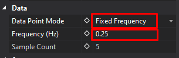

# Scatterplot Sampling Modes

## Overview

In the ATLAS Scatterplot, there is a selection of different _Data Point Modes_.
The different _Data Point Mode_ selection alters the way in which the X, Y (and Z) samples are calculated for plotting co-ordinates on the scatterplot.

These can be accessed via the _Display Properties_ Window for the Scatterplot.

There are 6 different modes, each illustrated below with a worked example:

* All Samples
* Fixed Frequency
* Fixed Sample count
* X Parameter
* Y Parameter
* Z Parameter

This mode setting applies at a _display_ level, so any plots within that display inherit these properties.

## All Samples Mode
_ATLAS 10.4.1 and later_

!!! note
    In this mode, the _Frequency (Hz)_ and _Sample Count_ fields are ignored and read only.

_All Samples_ mode in ATLAS Versions &gt;= 10.4.1 operates by taking each sample of the Highest rate parameter, and referencing the sample and hold values of the other parameter(s). There is no averaging of samples, and only real values will be plotted. 

If the X Parameter is logged at 100Hz, and the Y at 10Hz, the Y parameter will effectively be super-sampled at 100Hz in order to plot a point for each X parameter sample. If super-sampling is not desired, we recommend creating a function(s) which down-samples parameters where required, such that X, Y (and Z) are all at the same rate. 

### Example

| Time  | X Parameter Value (Blue) 2Hz   | Y Parameter Value (Red) 1Hz    | X Co-ordinate plotted  | Y Co-ordinate plotted  |
| ----- | --------------------------------- | --------------------------------- | ------------------------- | ------------------------- |
| 0.0   | 0                                 | 4	                                | 0	                        | 4                         |
| 0.5   | 1                                 |                                   | 1	                        | 4                         |
| 1.0   | 2                                 | 2	                                | 2	                        | 2                         |
| 1.5   | 3                                 |		                            | 3	                        | 2                         |
| 2.0   | 4                                 | 0	                                | 4	                        | 0                         |
| 2.5   | 5                                 |		                            | 5	                        | 0                         |

## X, Y, Z Parameter
_ATLAS 10.4.3 and later_

ATLAS 10.4.3 introduced 3 new modes in the scatterplot: X, Y and Z Parameter. 

These work in a similar manner to _All Samples_ mode &mdash; however instead of inferring the Highest rate parameter and using that to look up corresponding values on the other axes, the user can specify explicitly whether the X, Y or Z parameter is used as the "master".

### Example &mdash; X Parameter

For every sample of the X Parameter, a corresponding vale of Y (or Z) is referenced regardless of the rate of these parameters:

| Time  | X Parameter Value (Blue) 2Hz   | Y Parameter Value (Red) 1Hz    | X Co-ordinate plotted  | Y Co-ordinate plotted  |
| ----- | --------------------------------- | --------------------------------- | ------------------------- | ------------------------- |
| 0.0   | 0                                 | 4	                                | 0	                        | 4                         |
| 0.5   | 1                                 |                                   | 1	                        | 4                         |
| 1.0   | 2                                 | 2	                                | 2	                        | 2                         |
| 1.5   | 3                                 |		                            | 3	                        | 2                         |
| 2.0   | 4                                 | 0	                                | 4	                        | 0                         |
| 2.5   | 5                                 |		                            | 5	                        | 0                         |

### Example &mdash; Y Parameter

For every sample of the Y Parameter, corresponding samples of X (or Z) are referenced:

| Time  | X Parameter Value (Blue) 2Hz   | Y Parameter Value (Red) 1Hz    | X Co-ordinate plotted  | Y Co-ordinate plotted  |
| ----- | --------------------------------- | --------------------------------- | ------------------------- | ------------------------- |
| 0.0   | 0                                 | 4	                                | 0	                        | 4                         |
| 0.5   | 1                                 |                                   |  	                        |                           |
| 1.0   | 2                                 | 2	                                | 2	                        | 2                         |
| 1.5   | 3                                 |		                            |  	                        |                           |
| 2.0   | 4                                 | 0	                                | 4	                        | 0                         |
| 2.5   | 5                                 |		                            |  	                        |                           |

## Fixed Frequency and Fixed Sample Count Modes

_Fixed Frequency_ mode reads the _Frequency (Hz)_ field, but ignores _Sample Count_.

_Fixed Sample Count_ mode reads the _Sample Count_ field, but ignores _Frequency (Hz)_.

_Fixed Frequency_ &amp; _Fixed Sample Count_ modes calculate samples to plot in a very similar way.  
Both of these modes calculate a Time Period and then plot **averages** of X, Y or Z parameters over that Period.

* If a Period only spans a single sample, then the real sample value will be used;
* If the Period spans multiple samples, then those samples will be averaged.

The only difference between the modes is how the Time Period is calculated. 

### Fixed Frequency Period Calculation
Fixed Frequency Sample Time Period is set by a frequency. 

_Time Period = 1/Frequency (Hz)_ 

If the Frequency is set to _0.25Hz_, then the Time period will be _4 seconds_ _(1/0.25)_.

### Fixed Sample Count Period Calculation
Fixed Sample Count Time Period is set by splitting up the Display Time range, into a number of samples. 

_Time Period = Display Time Range / Number of Samples_

If the Display Time range is displaying _20 seconds_ of data (can be changed by Zoom Level), and the Number of Samples is set to _5_, then the Time Period will be _4 seconds_ _(20/5)_.

### Example &mdash; Fixed Frequency &amp; Fixed Sample Counts

<table>
    <thead>
        <tr>
            <th>Time</th>
            <th>X Parameter Value (Blue) 2Hz</th>
            <th>Y Parameter Value (Red) 1Hz</th>
            <th>X Co-ordinate plotted</th>
            <th>Y Co-ordinate plotted</th>
        </tr>
    </thead>
    <tbody>
        <tr>
            <th rowspan="3" style="writing-mode: sideways-lr">Sample Period 1 0-1.5 Seconds</th>
            <td>0</td>
            <td>4</td>
            <td rowspan="3">(0+1+2) / 2 = 1.5</td>
            <td rowspan="3">(4+2) / 2 = 3</td>
        </tr>
        <tr>
            <td>1</td>
            <td></td>
        </tr>
        <tr>
            <td>2</td>
            <td>2</td>
        </tr>
        <tr>
            <th rowspan="3" style="writing-mode: sideways-lr">Sample Period 2 1.5-3.0 Seconds</th>
            <td>3</td>
            <td></td>
            <td rowspan="3">(3+4+5) / 2 = 6</td>
            <td rowspan="3">0</td>
        </tr>
        <tr>
            <td>4</td>
            <td>0</td>
        </tr>
        <tr>
            <td>5</td>
            <td></td>
        </tr>
    </tbody>
</table>

In the example above, Sample Period of 1.5 seconds could be achieved in both _Fixed Frequency_  or _Fixed Sample Count_:

_Time Period (Fixed Frequency) = 1 / **0.667Hz**_

_Time Period (Number of Samples) = 6 (seconds on display) / **2 (samples)**_

## Obsolete Behaviour &mdash; Prior to ATLAS 10.4.1

In ATLAS versions &lt; 10.4.1, _All Samples_ mode worked slightly differently.  
Instead of using the Highest Rate parameter, each Sample of the Lowest Rate Parameter is taken, with higher rate parameters being **averaged** over the period between each Low Rate Parameter Sample. This means that the high rate co-ordinates are averages, and not necessarily real sample values. 

### Example &mdash; All Samples mode prior to ATLAS 10.4.1

| Time      | X Parameter Value (Blue) 2Hz   | Y Parameter Value (Red) 1Hz    | X Co-ordinate plotted  | Y Co-ordinate plotted  |
| --------- | --------------------------------- | --------------------------------- | ------------------------- | ------------------------- |
| 0.0-0.5   | 0                                 | 4	                                | (0+1) / 2 = 0.5	        | 4                         |
| 0.5-1.0   | 1                                 |                                   | 	                        |                           |
| 1.0-1.5   | 2                                 | 2	                                | (2+3) / 2 = 2.5	        | 2                         |
| 1.5-2.0   | 3                                 |		                            | 	                        |                           |
| 2.0-2.5   | 4                                 | 0	                                | (4+5) / 2 = 4.5	        | 0                         |
| 2.5-3.0   | 5                                 |		                            | 	                        |                           |
