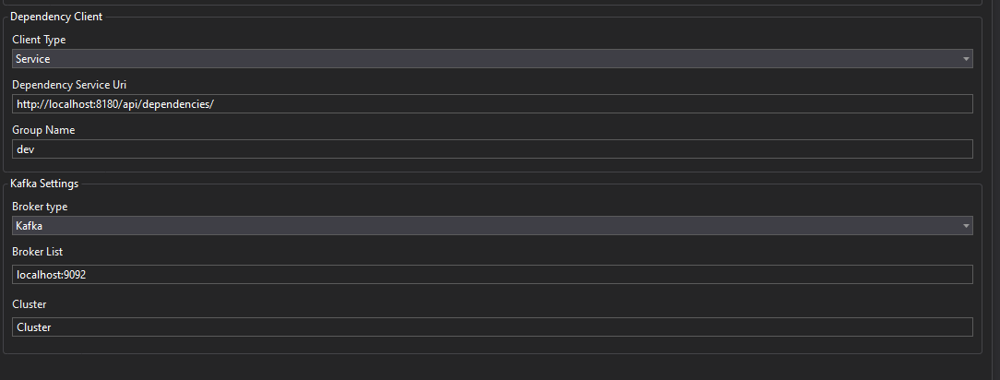
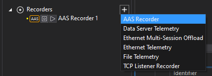
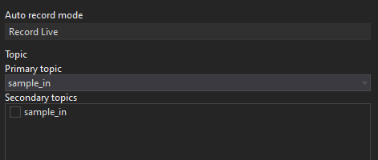

# ATLAS Visualisation

_Visualising streaming data into ATLAS using AAS Recorder._

There is an ATLAS Advanced Streams "AAS recorder" included with ATLAS 10, which can be configured in _Tools > Options > Recorders > AAS Recorder_ 

Configure the Dependencies Service client:
- _Client type_: Service
- Dependencies service URI similar to http://localhost:8180/api/dependencies
    - Adjust the URI to match the host reachable from the client
    - Include the trailing slash in the URI
- Enter `dev` for the _Group_ name
    - This is namespacing token. The Streaming Dependencies Service ships pre-configured to whitelist the `dev` group, but additional groups can be configured

Configure the Kafka settings:

- Broker list:
    - For a single node, format as: `server:9092`
    - For a cluster, format as: `server1:9092, server2:9092, server:9092`
- Cluster
    - Friendly name for the Kafka Cluster

Press _OK_ to commit your changes. Verify that your 

In ATLAS, add an AAS recorder from Session Browser:

The relevant topic should appear in the Recorder Editor's drop down ("sample_in" in this case):

 