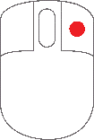

# Mouse Gestures

A mouse with a scroll-wheel is recommended, though many actions have [Keyboard Shortcuts](keyboard.md).

 

{class="mouse-img"} Use the scroll wheel to zoom in and out on a Waveform Display or the Bing Map Display.

 

{class="mouse-img"} Left click to select menu items and click buttons.

 

{class="mouse-img"} Right click to display context sensitive (pop-up) menus where available.

 

{class="mouse-img"} Hold both buttons and move the mouse left or right to scroll a Waveform Display left or right.

 

{class="mouse-img"} Left click, hold and drag to scroll the time reference indicator on a Timeline in the direction of the mouse movement.  
This action can also be used to drag and drop parameters.

 

{class="mouse-img"} Right click, hold and drag to select a section of a waveform which you can then choose to zoom in on by selecting Zoom from the pop-up menu.
